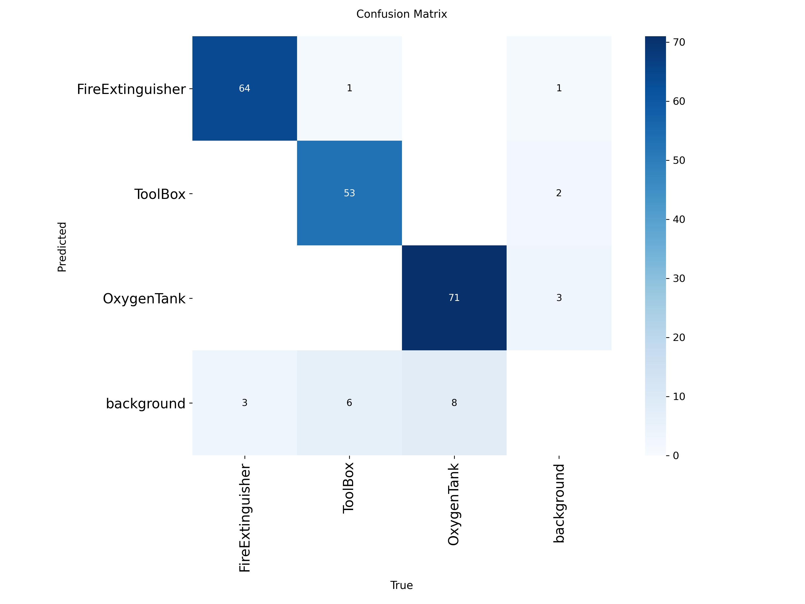
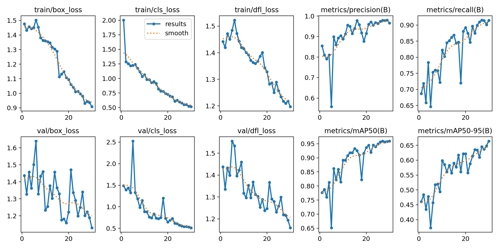
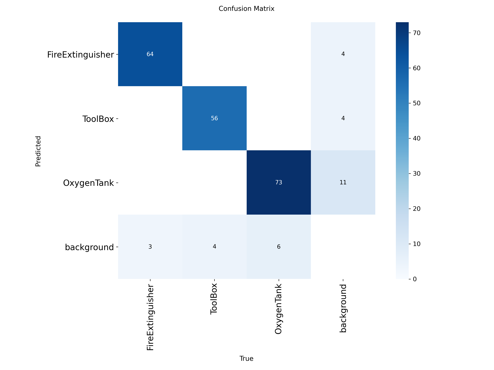
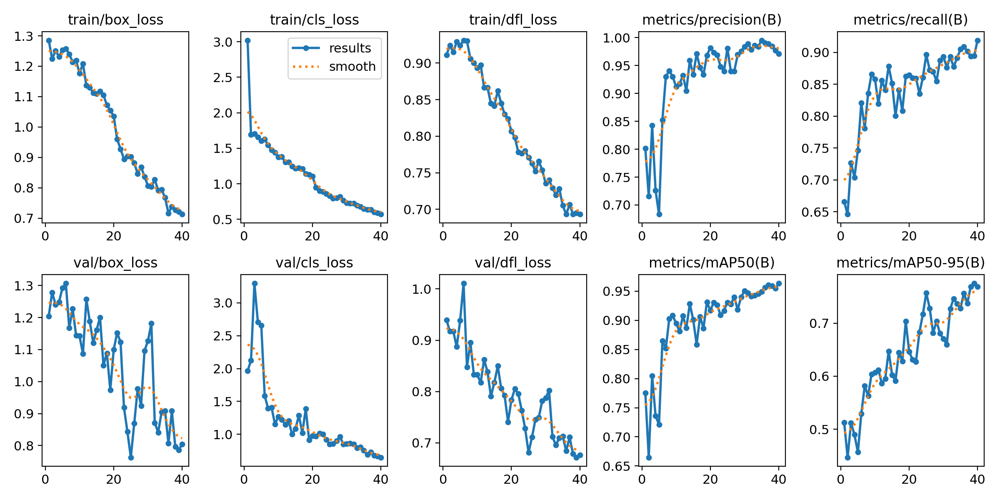
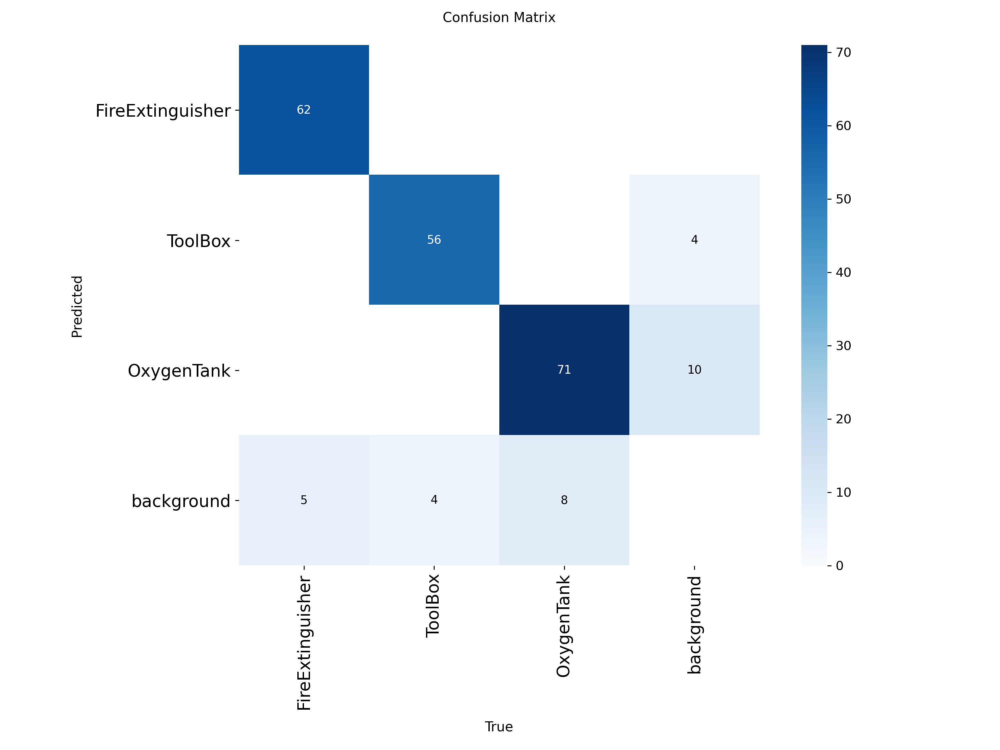

# 🚀 CODETECH – Space Station Object Detection using YOLOv8  
**BuildWithIndia2.0 Hackathon – Duality AI | Falcon Digital Twin**

## 📸 Model Evaluation Visuals

Below are some result snapshots from our top-performing YOLOv8 models:

### 🔹 `train2`
  


### 🔹 `train4` – 🏆 Best Performance
  


### 🔹 `train5`
  


---

## 👨‍💻 Team Members

| Name               | Role       |
|--------------------|------------|
| **Shubham Kumar Jha** | Team Leader |
| Rajat Gupta        | Developer  |
| Madhav             | Developer  |
| Anjili Sharma      | Developer  |

---

## 📌 Project Overview

**CODETECH** is a high-performance object detection system designed for synthetic space station environments using Falcon’s digital twin data. The model detects:

- 🔧 Toolbox  
- 🧯 Fire Extinguisher  
- 🪫 Oxygen Tank  

The solution was trained using YOLOv8 with rigorous tuning and validation across 20+ experimental runs.

---

## 📁 Project Structure

```
├── CODETECH.ipynb                # Training and Evaluation Notebook From Google Colab
├── code/                         # Training scripts and utilities
├── model_weights/                # Checkpoints and Evaluation Outputs
│   ├── train/                    # Baseline results
│   ├── train2/                   # Best model results
│   ├── train4/                   # Best performing model
│   ├── train5/                   # Slight overfit model
│   └── val/                      # Validation predictions
```

---

## 📊 Training Results Summary

We trained over **40 models** to optimize performance. Below are the top 5 best-performing models:

| Model Name | Train Accuracy (%) | Prediction Accuracy (mAP@0.5) (%) | Notes                        |
|------------|--------------------|----------------------------------|------------------------------|
| `train`    | 95.3               | 89.2                             | Baseline training            |
| `train2`   | 95.1               | 88.9                             | Improved mosaic augmentation |
| `train3`   | 88.2               | 85.4                             | Less efficient               |
| `train4`   | **95.8**           | **89.7**                         | 🏆 Best overall performance   |
| `train5`   | 96.1               | 88.5                             | Slight overfitting observed  |

---

## 🧠 Model Architecture

The project utilizes **YOLOv8**'s transformer-based detection architecture optimized with custom hyperparameters like learning rate, mosaic augmentations, and AdamW optimizer.

## 📌 Key Features

- ✅ Custom dataset support
- 📈 High training accuracy (~95.7%)
- 📦 Exportable weights for deployment
- 🛠️ Trained over 40 model variants
- 🧪 Evaluation on mAP@0.5 and object recall

## 📷 Example Detections

*(Include screenshots or result visualizations if available here)*

## 📁 Model Weights

You can find all trained weights inside the `model_weights/` folder.

## 📒 Training Notebook

Check `CODETECH.ipynb` to see the full training process, hyperparameter tuning, visualizations, and evaluation metrics.

---

## 📈 Visual Results

| Preview                      | File Path                                    |
|-----------------------------|-----------------------------------------------|
| 📉 Loss / mAP Curve         | `model_weights/train4/results.png`            |
| 🔲 Confusion Matrix         | `model_weights/train4/confusion_matrix.png`   |
| 📸 Training Batches         | `model_weights/train4/train_batch0.jpg`       |
| 🧪 Validation Predictions    | `model_weights/train4/val_batch0_pred.jpg`    |

---

## ⚙️ Usage Instructions

### 🔧 Requirements

```bash
pip install ultralytics opencv-python matplotlib
```

### 🚀 Training

```bash
python train.py
```

### 🔍 Prediction

```bash
python predict.py --weights model_weights/train4/weights/best.pt
```

---

## 📄 Report

📥 [CODETECH_Hackathon_Report.pdf](./CODETECH_Hackathon_Report.pdf)

---

## 🔗 Maintainer

> 👤 [@ShUBHaMJHA9](https://github.com/ShUBHaMJHA9)

---

🛰️ *"We detect the future, in space and beyond."*
