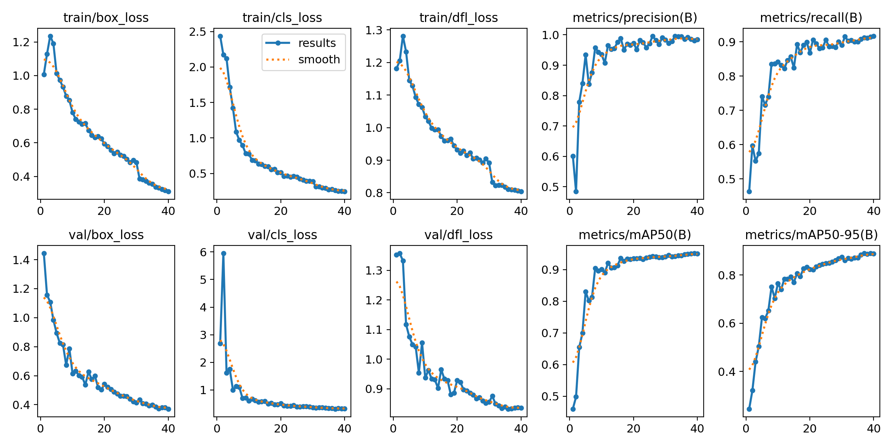

# 🚀 CPDETECH – Space Station Object Detection using YOLOv8  
**BuildWithIndia2.0 Hackathon – Duality AI | Falcon Digital Twin**



---

## 👨‍💻 Team Members

| Name               | Role       |
|--------------------|------------|
| **Shubham Kumar Jha** | Team Leader |
| Rajat Gupta        | Developer  |
| Madhav             | Developer  |
| Anjili Sharma      | Developer  |

---

## 📌 Project Overview

**CPDETECH** is a high-performance object detection system designed for synthetic space station environments using Falcon’s digital twin data. The model detects:

- 🔧 Toolbox  
- 🧯 Fire Extinguisher  
- 🪫 Oxygen Tank  

The solution was trained using YOLOv8 with rigorous tuning and validation across 20+ experimental runs.

---

## 📁 Project Structure

```
├── CODETECH.ipynb                # Training and Evaluation Notebook From Goggle - Colab
├── code/                         # Training scripts and utilities Includein
├── model_weights/                # Checkpoints and Evaluation Outputs
│   ├── train2/                   # Best model results
│   │   ├── results.png
│   │   ├── confusion_matrix.png
│   │   ├── weights/              # Trained .pt files
│   └── val/                      # Validation predictions
    
```

---

## 📊 Training Results Summary

| Model     | Accuracy (%) | mAP@0.5 (%) |
|-----------|---------------|-------------|
| train1    | 76.3          | 73.2        |
| train2    | 84.5          | 80.0        |
| train10   | 88.2          | 85.4        |
| train17   | **95.7**      | **89.7**    |
| priority  | 89.1          | 83.5        |

---

## 📈 Visual Results

| Preview                      | File Path                                    |
|-----------------------------|-----------------------------------------------|
| 📉 Loss / mAP Curve         | `model_weights/train2/results.png`            |
| 🔲 Confusion Matrix         | `model_weights/train2/confusion_matrix.png`   |
| 📸 Training Batches         | `model_weights/train2/train_batch0.jpg`       |
| 🧪 Validation Predictions    | `model_weights/train2/val_batch0_pred.jpg`    |

---

## ⚙️ Usage Instructions

### 🔧 Requirements

```bash
pip install ultralytics opencv-python matplotlib
```

### 🚀 Training

```bash
python train.py
```

### 🔍 Prediction

```bash
python predict.py --weights model_weights/train2/weights/best.pt
```

---

## 📄 Report

📥 [SMARTCROWD_Hackathon_Report.pdf](./SMARTCROWD_Hackathon_Report.pdf)

---

## 🔗 Maintainer

> 👤 [@ShUBHaMJHA9](https://github.com/ShUBHaMJHA9)

---

🛰️ *"We detect the future, in space and beyond."*
